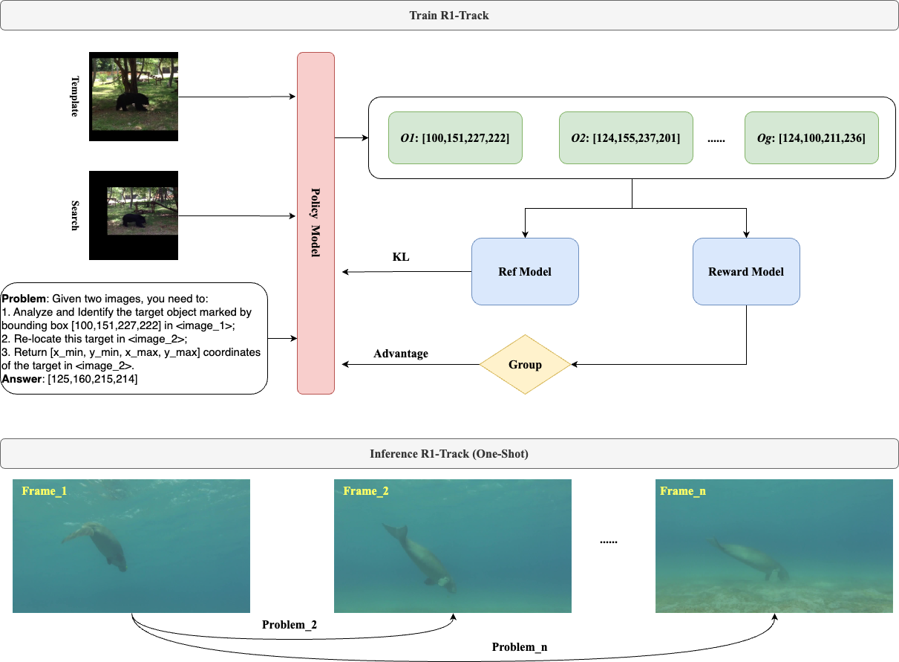

# R1-Track: Direct Application of MLLMs to Visual Object Tracking via Reinforcement Learning
<div align="center">

</div>

- Visual (Single) Object Tracking aims to continuously localize and estimate the scale of a target in subsequent video frames, given only its initial state in the first frame. This task can be simplified to template matching between image pairs, with traditional trackers predominantly employing explicit classification-regression modeling through Correlation Filters, Siamese networks, and Vision Transformers (ViT). Leveraging advancements in Multi-Modal Large Language Models (MLLMs) such as Qwen2.5-VL and their robust grounding capabilities, we explore adopting MLLMs for end-to-end tracking tasks, eliminating the need for fragmented subtask modeling.

- R1-Track supports flexible initialization from either **text descriptions** or **bounding boxes**.


## Prompt
- **SFT or RL_wo_Think**
```python
    {
        "role": "user",
        "content": [
            {
                "type": "image",
                "image": xxx,
            },
            {
                "type": "image",
                "image": xxx,
            },
            {"type": "text", "text": "Please identify the target specified by the bounding box [241,66,329,154] in the first image and locate it in the second image. \n Return the coordinates in [x_min,y_min,x_max,y_max] format."},
            # New Version (After 20250503): Given two images, you need to:\n1. Analyze and Identify the target object marked by bounding box <BBOXFLAG> in <image_1>;\n2. Re-locate this target in <image_2>;\n3. Return [x_min, y_min, x_max, y_max] coordinates of the target in <image_2>.
        ],
    }
```

- **RL_with_Think**
```python
    {
        "role": "user",
        "content": [
            {
                "type": "image",
                "image": xxx,
            },
            {
                "type": "image",
                "image": xxx,
            },
            {"type": "text", "text": "You FIRST think about the reasoning process as an internal monologue and then provide the final answer. \n The reasoning process MUST BE enclosed within <think> </think> tags. The final answer MUST BE put in <answer> </answer> tags. \n Please identify the target specified by the bounding box [241,66,329,154] in the first image and locate it in the second image. \n Return the coordinates in [x_min,y_min,x_max,y_max] format."},
        ],
    }
```


## Data
- **R1-Track-5k**
    - This dataset is available at https://huggingface.co/datasets/WangBiao/R1-Track-5k (For EasyR1) and https://huggingface.co/datasets/WangBiao/R1-Track-Data-ShareGPT (For Llamafactory).
    - $336 \times 336$, 2 images.
    - This dataset was randomly sampled from [GOT10k](http://got-10k.aitestunion.com/) and has not undergone manual review. Some image pairs are of relatively low quality.
- **R1-Track-100k**
    - This dataset is available at https://huggingface.co/datasets/WangBiao/R1-Track-100k.
    - $112 \times 112, 224 \times 224, 336 \times 336, 448 \times 448$, 2 images and 3 images
    - This dataset was also randomly sampled from [GOT10k](http://got-10k.aitestunion.com/)


## Quick Start
- **SFT**
1. *Env Preparation*
```bash
Please refer to the official LLaMA-Factory repo for env configuration guidelines, and add the supplied datasets and scripts to the specified directories as outlined in the documentation.
```

2. *Train Lora*
```bash
CUDA_VISIBLE_DEVICES=0,1,2,3 llamafactory-cli train examples/train_lora/r1_track_lora_sft.yaml
```

3. *Merge Lora*
```bash
llamafactory-cli export examples/merge_lora/r1_track_lora_sft.yaml
```

- **RL**
1. *Env Preparation*
```bash
Please refer to the official EasyR1 repo for env configuration guidelines.
```

2. *Train*
```bash
cd EasyR1
bash examples/qwen2_5_vl_3b_track5k_grpo_w_think.sh
```

- **Infer**
1. *Deployment*
```bash
CUDA_VISIBLE_DEVICES=0,1,2,3 python -m vllm.entrypoints.openai.api_server --served-model-name R1-Track --model  WangBiao/R1-Track-GRPO  --gpu-memory-utilization 0.9 --tensor-parallel-size 4 --port 8888 --limit-mm-per-prompt image=2
```

2. *Tracking on GOT10k*
```bash
python infer_script/r1track.py
```


## Results
- Our initial R1-Track-GRPO model achieved an AO score of 0.586 on GOT10k test set without tuning any tracking hyperparameters (including template and search region sizes), using only 5k low-quality image pairs for training. In contrast, the preliminary R1-Track-SFT failed to produce valid test results due to severe overfitting.
- Our R1-Track-GRPO-0503 model achieved an **AO** score of **0.681** on GOT10k test set.

| Tracker/GOT10k                |Crop Size|Finetune Data| $AO$    |  $SR_{0.5}$  |  $SR_{0.75}$| Params       |Ckpt|
|----|----|----|----|----|----|----|----|
|LLaVA-1.5                      |-|-|0.235|0.202|-            | 7B           |-   |
|Qwen2.5-VL-7B-Instruct         |-|-|0.126|0.011|-            | 7B           |-   |
|Qwen2.5-VL-72B-Instruct        |-|-|-    |-    |-            | 72B          |-   |
| **R1-Track-SFT**              |$336 \times 336$| R1-Track-5K |-        |-             |-            | 3B           |[R1-Track-SFT](https://huggingface.co/datasets/WangBiao/R1-Track-5k)  |
| **R1-Track-GRPO**             |$336 \times 336$| R1-Track-5K |0.586    |0.676         |0.470        | 3B           |[R1-Track-GRPO](https://huggingface.co/WangBiao/R1-Track-GRPO)   |
| **R1-Track-GRPO-wo-Think**    |$336 \times 336$| R1-Track-5k |0.585    |0.673         |0.500        | 3B           |  [R1-Track-GRPO-wo-Think](https://huggingface.co/WangBiao/R1-Track-GRPO-wo-Think) |
| **R1-Track-GRPO-wo-Think-0503** |$336 \times 336$| R1-Track-100k |0.680    |0.766         |0.637      | 3B           |[R1-Track-GRPO-wo-Think-0503](https://huggingface.co/WangBiao/R1-Track-GRPO-wo-Think-0503)   |


## Visualization
**Click anywhere**
[](https://youtu.be/jJUT1lQHYEE?si=GbEMoJ1RYuxGYpyS "R1-Track")


## News
- [2025/04/02] **We released 🤗[R1-Track-5K](https://huggingface.co/datasets/WangBiao/R1-Track-5k) dataset!**
- [2025/04/20] **We released 🤗[R1-Track-SFT](https://huggingface.co/WangBiao/R1-Track-SFT) model!**
- [2025/04/24] **We released 🤗[R1-Track-Data-ShareGPT](https://huggingface.co/datasets/WangBiao/R1-Track-Data-ShareGPT) dataset. You can effortlessly integrate it with [LlamaFactory](https://github.com/hiyouga/LLaMA-Factory) for use!**
- [2025/04/27] **We released the R1-Track inference script for GOT-10k dataset evaluation!**
- [2025/04/27] **We released the R1-Track-GRPO training script based on [EasyR1](https://github.com/hiyouga/EasyR1)!**
- [2025/04/28] **We released 🤗[R1-Track-GRPO](https://huggingface.co/WangBiao/R1-Track-GRPO) model!**
- [2025/04/28] **We released 🤗[R1-Track-GRPO-wo-Think](https://huggingface.co/WangBiao/R1-Track-GRPO-wo-Think) model!**
- [2025/05/03] **We released 🤗[R1-Track-100K](https://huggingface.co/datasets/WangBiao/R1-Track-100k) dataset!**


## TODO
- [x] Generate a more refined, large-scale, and diversified dataset based on existing tracking training data;
- [ ] Train the 7B model;
- [ ] Support for multi-image or video (i.e. temporal information modeling);
- [ ] Explore improved methods for generating cold-start COT data;
- [ ] Supports evaluating other tracking datasets.

We will strive to elevate R1-Track to the `T0` level of trackers.


# Acknowledgement
- Base Model: We use [Qwen2.5-Vl-Instruct-3B](https://github.com/QwenLM/Qwen2.5-VL) as our base model.
- SFT: We perform supervised fine-tuning based on [LLama-Factory](https://github.com/hiyouga/LLaMA-Factory).
- RL: We conduct reinforcement learning fine-tuning using [EasyR1](https://github.com/hiyouga/EasyR1).
- Inference: [vllm](https://github.com/vllm-project/vllm).
- Data: We utilized a portion of the [GOT10k-train](http://got-10k.aitestunion.com/) dataset to assemble our training set and conducted one-shot testing exclusively on [GOT10k-test](http://got-10k.aitestunion.com/).


## Citation
```bibtex
@misc{wang2025r1track,
  title        = {R1-Track: Direct Application of MLLMs to Visual Object Tracking via Reinforcement Learning},
  author       = {Biao Wang},
  howpublished = {\url{https://github.com/Wangbiao2/R1-Track}},
  year         = {2025}
}
```